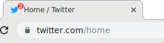
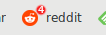
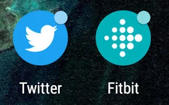

# Badging API Explainer

Author: Matt Giuca <mgiuca@chromium.org><br>
Author: Jay Harris <harrisjay@chromium.org><br>
Author: Marcos Cáceres <mcaceres@mozilla.org>

Date: 2019-07-17

## Table of Contents
<!-- START doctoc generated TOC please keep comment here to allow auto update -->
<!-- DON'T EDIT THIS SECTION, INSTEAD RE-RUN doctoc TO UPDATE -->


- [Overview](#overview)
- [Usage examples](#usage-examples)
- [Goals and use cases](#goals-and-use-cases)
  - [Use with Notifications](#use-with-notifications)
- [Badge scope](#badge-scope)
  - [Nested scopes](#nested-scopes)
- [Background updates](#background-updates)
  - [The Push problem](#the-push-problem)
  - [Periodic Background Sync](#periodic-background-sync)
  - [Possible changes to the Push API](#possible-changes-to-the-push-api)
    - [Waiving the notification requirement](#waiving-the-notification-requirement)
    - [A separate channel for Badge payloads](#a-separate-channel-for-badge-payloads)
    - [Conclusion](#conclusion)
- [Feature detection](#feature-detection)
- [A case for separation](#a-case-for-separation)
- [Detailed API proposal](#detailed-api-proposal)
  - [The model](#the-model)
  - [The API](#the-api)
  - [UX treatment](#ux-treatment)
- [Security and Privacy Considerations](#security-and-privacy-considerations)
- [Design Questions](#design-questions)
  - [What data types are supported in different operating systems?](#what-data-types-are-supported-in-different-operating-systems)
  - [Why limit support to just an integer? What about other characters?](#why-limit-support-to-just-an-integer-what-about-other-characters)
  - [Couldn’t this be a declarative API (i.e., a DOM element), so it would work without JavaScript?](#couldnt-this-be-a-declarative-api-ie-a-dom-element-so-it-would-work-without-javascript)
  - [Is this API useful for mobile OS’s?](#is-this-api-useful-for-mobile-oss)
  - [Why is this API attached to `window` instead of `navigator` or `notifications`?](#why-is-this-api-attached-to-window-instead-of-navigator-or-notifications)
  - [Is there an upper limit on the size of the integer? And if so, what's the behavior if that limit is reached?](#is-there-an-upper-limit-on-the-size-of-the-integer-and-if-so-whats-the-behavior-if-that-limit-is-reached)
  - [Are you concerned about apps perpetually showing a large unread count?](#are-you-concerned-about-apps-perpetually-showing-a-large-unread-count)
  - [Internationalization](#internationalization)
  - [Index of Considered Alternatives](#index-of-considered-alternatives)

<!-- END doctoc generated TOC please keep comment here to allow auto update -->

## Overview

The **Badging API** is a proposed Web Platform API allowing websites to apply
badges (small status indicators) to pages or sets of pages on their origin. We
are deliberately agnostic about which contexts a badge can appear in, but have
two fairly different contexts in mind:

* "Document" contexts, associated with an open document, such as when a badge is
  shown on or near the page's icon in a browser tab.
* "Handle" contexts, associated with a handle or link to a site somewhere in the
  user agent or operating system UI, but not necessarily associated with a
  running document, such as a bookmark or [installed web
  app](https://www.w3.org/TR/appmanifest/#installable-web-applications) icon.

Here is a mock of a badge being applied to the page tab:



This use case is already satisfied today with sites dynamically setting either
their favicon or title to include some status indicator. The use of an explicit
badge API has a number of advantages over the "hack" ways:

* The badge can appear outside (completely, or partially overlapping) of the
  favicon, leaving more room for the site's brand image.
* The badge is meaningful to the user agent, which can present it to the user in
  various ways, such as announcing it verbally to a user using a screen reader.
* Badges can be displayed with a consistent style across websites, chosen by the
  user agent.
* User agents can provide a way for users to disable badges on a per-site or
  global basis.

The "handle" context is more nebulous because it means associating a badge with
any place the user agent shows an icon representing a site, page or app. For
example, it could be applied to an icon in the bookmark bar, or a "commonly
visited sites" index on the new tab page.


<br>Mock of a badge being applied to the bookmark bar

For [installed web
applications](https://www.w3.org/TR/appmanifest/#installable-web-applications),
the badge can be applied in whatever place the OS shows apps, such as the shelf,
home screen or dock.

Here are some examples of app badging applied at the OS level:


<br>Windows taskbar badge


<br>macOS dock badge


<br>Android home screen badge

Unlike document contexts, badges applied in "handle" contexts can be shown and
updated even when there are no tabs or windows open for the app. So there are
some special considerations for this use case, such as how to set the badge in
response to a [Push message](https://www.w3.org/TR/push-api/), and how to scope
a badge so that it appears on the desired set of pages or apps. The most
commonly requested use case for "handle" badging is badging an app icon on the
OS shelf, but it generalizes to non-installed sites as well.

## Usage examples

The simplest possible usage of the API is a single call to `Badge.set` from a
foreground context (which might be used to show an unread count in an email
app):

```js
Badge.set(getUnreadCount());
```

This will set the badge for all pages and apps in the current origin until it is
changed. If `getUnreadCount()` (the argument to `Badge.set`) is 0, it will
automatically clear the badge.

If you just want to show a status indicator flag without a number, use the
Boolean mode of the API by calling `Badge.set` without an argument, and
`Badge.clear` (which might be done to indicate that it is the player's turn to
move in a multiplayer game):

```js
if (myTurn())
  Badge.set();
else
  Badge.clear();
```

The reason we are considering both the "document" and "handle" contexts in the
same API, and not two separate badging APIs, is so that in the common case,
developers can just set a badge for the origin and have it show up in whatever
places the user agent wants to show it. However, if you just want to badge a
specific set of URLs, and not the whole site, use the `scope` option (which
might be done if you have a different "unread count" on each page):

```js
Badge.set(getUnreadCount(location.pathname), {scope: location});
```

The scope is a URL prefix; the badge is applied on all pages whose URL [starts
with](https://www.w3.org/TR/appmanifest/#dfn-within-scope) that prefix.

More advanced examples are given in a [separate document](docs/examples.md).

## Goals and use cases

The purpose of this API is:

* To subtly notify the user that there is new activity that might require their attention without requiring an OS-level [notification](https://notifications.spec.whatwg.org/).
* To indicate a small amount of additional information, such as an unread count.
* To allow certain pages that a user agent deems interesting to a user (such as Bookmarks or [Installed Web Applications](https://www.w3.org/TR/appmanifest/#installable-web-applications)) to convey this information, regardless of whether they are currently open.
* To allow setting the badge when no documents from the site are running (e.g. an email app updating an unread count in the background).

Non-goals are:

* To provide an arbitrary image badge. The web platform already provides this capability via favicons.

Possible areas for expansion:

* Support rendering a small status indicator (e.g., a music app shows ▶️ or ⏸️; a weather app shows ⛈️ or ⛅️): either a pre-defined set of glyphs or simply allowing a Unicode character to be rendered.

Examples of sites that may use this API:

* Chat, email, and social apps could signal that new messages have arrived.
* Any application that needs to signal that user action is required (e.g., in a turn-based game, when it is the player's turn).
* As a permanent indicator of a page's status (e.g., on a build page, to show that the build has completed).

### Use with Notifications

The Badge API goes hand-in-hand with Notifications, since both APIs provide a
way to give the user updates when they aren't directly looking at the page.
Arguably, Badge could be part of Notifications, but we view it as a separate,
complementary API.

Advantages of using the badging API over notifications:

* Can be used for much higher frequency / lower priority events than notifications, because each new event does not disrupt the user.
* There may be no need to request permission to use the badging API, since it is much less invasive than a notification.

Typically, sites will want to use both APIs together: notifications for high-importance events such as new direct messages or incoming calls, and badges for all new messages including group chats not directly addressed to the user.

## Badge scope

This section explains the difference between badging a *set of URLs* versus
badging a *document*.

Consider four increasingly narrow sets of pages that a Badge is applied to:

1. An entire origin (e.g., when you just want to set an unread count for the
   entire site).
2. All pages whose URL [starts
   with](https://www.w3.org/TR/appmanifest/#dfn-within-scope) a given path
   (e.g., if a site is organised into "projects", each with their own status
   indicator).
3. All pages with a specific URL path (e.g., if each page has a separate status
   indicator, but all tabs open at a certain URL should share status).
4. A specific document (e.g., if many tabs can be open with URLs on the same
   path, but might have different status, due to either a different query
   string, or different dynamic context inside the document).

Number 3 and 4 seem very similar, but architecturally are very different. In
3, the badge is associated with a URL (and any current or future documents open
at that URL will show that badge), whereas in 4, the badge is associated with a
particular document — other tabs open to the same URL will not share the badge.

What this boils down to is two different modes:

* Badging a particular URL scope, applied to the set of URLs that start with the
  same path. This covers 1, 2 and 3 above.
* Badging a particular document, applied to only the browser tab containing the
  document.

The API for requesting to badge the current document, as opposed to a URL set,
is still under consideration. It may simply be a separate option member, e.g.:

```js
Badge.set(getUnreadCount(), {scopeDocument: true});
```

When displaying the badge for an app, the user agent should use the badge
matching the app's [scope URL](https://www.w3.org/TR/appmanifest/#scope-member).

### Nested scopes

Since we allow badges to be scoped to different, potentially nested, URLs, it
means that a particular page can be subject to more than one badge at a time.
In this case, the user agent should display only the badge with the most
specific [scope](https://www.w3.org/TR/appmanifest/#scope-member).

Therefore, clearing a badge (either by calling `Badge.clear()` or
`Badge.set(0)`) does *not necessarily* mean that no badge will be displayed; by
erasing a badge at one level, a page may inherit a badge from a higher level.

For example, consider a site that has made the following two calls:

* `Badge.set(6, {scope: '/users/'});`
* `Badge.set(2, {scope: '/users/1'});`

Now all pages in '/users/' show the badge "6", except for `/users/1`, which
shows the badge "2".

Now if we see `Badge.clear({scope: '/users/1'})`, the pages under `/users/1`
will start showing the badge "6" since that badge is still in effect. If instead
we see `Badge.clear({scope: '/users/'})`, the pages under `/users/1` will still
show the badge "2", *even if `clear` is called from one of those pages*.
See [this
example](docs/examples.md#badging-for-multiple-apps-on-the-same-origin-as-in-the-case-of-multiple-github-pages-pwas).

## Background updates

For the *handle* context badges, we would like to be able to update the badge
with a server-side push, while there are no active documents open. This would
allow, for example, app icon badges to show an up-to-date unread count even when
no pages are open.

In this section, we explore two APIs that could be useful for this: [Push
API](https://www.w3.org/TR/push-api/) and [Periodic Background
Sync](https://github.com/WICG/BackgroundSync/blob/master/explainer.md#periodic-synchronization-in-design).

### The Push problem

The [Push API](https://www.w3.org/TR/push-api/) allows servers to send messages
to service workers, which can run JavaScript code even when no foreground page
is running. Thus, a server push could trigger a `Badge.set`.

However, there is a [de facto standard
requirement](https://github.com/w3c/push-api/issues/313) that whenever a push is
received, a notification needs to be displayed. This means it's impossible to
subtly update a badge in the background while no pages are open, without also
displaying a notification.

This may be fine for some use cases (if you want to always show a notification
when updating the badge, possibly with an exception of not showing a
notification if the app is in the foreground). But we specifically designed this
API as a *subtle* notice mechanism that does not require a more distracting
notification in order to set a badge. Because of this de facto requirement, the
Push API currently isn't suitable for this use case.

There is also a requirement that the user grants notification permission to
subscribe to push messages.

### Periodic Background Sync

[Periodic Background
Sync](https://github.com/WICG/BackgroundSync/blob/master/explainer.md#periodic-synchronization-in-design)
is a proposed extension to the [Background
Sync](https://wicg.github.io/BackgroundSync/spec/) API, that allows a service
worker to periodically poll the server, which could be used to get an updated
status and call `Badge.set`. However, this API is unreliable: the period that it
gets called is at the discretion of the user agent and can be subject to things
like battery status. This isn't really the use case that Periodic Background
Sync was designed for (which is having caches updated while the user isn't
directly using a site, not updating UI that's immediately visible to the user).

That means when the page isn't open, you could have the badge indicator update
every once in awhile, but have no guarantee that it would be up to date.

(Also, the Periodic Background Sync API is not yet implemented in any browser,
though it is in an origin trial in Chrome.)

It's possible that the use of Push API and Periodic Background Sync together is
"good enough": high-priority notices (that show a notification) come in through
a Push and are displayed immediately with a notification; low-priority notices
are displayed as badges immediately if there are pages open, or "eventually" if
there are no pages open.

However, in our view, there is a need for *immediate* update to low-priority
notices: this is akin to the [urgency vs importance](https://en.wikipedia.org/wiki/Time_management#The_Eisenhower_Method)
dichotomy: a badge is for non-important information but that doesn't mean the
user doesn't want to see the notice in a timely fashion.

### Possible changes to the Push API

Here we discuss ways to potentially allow the Push API to update badges without
showing notifications.

**Note: This should not be considered blocking.** The Badge API is perfectly
usable, including from service workers, without these changes, so we consider
these as add-ons that we could introduce at a later time.

#### Waiving the notification requirement

The purpose of the [de facto
requirement](https://github.com/w3c/push-api/issues/313) to show a notification
upon receipt of a push message is to prevent malicious sites from using
high-frequency pushes to do invisible background work, such as crypto mining
(use of the user's computing resources) or monitoring the user's IP address,
giving coarse-grained geographic location (privacy concern). The theory is that
if the site is required to show a notification on each push, the user is at
least going to be aware that the site is constantly doing something, and if it's
unreasonably spammy, the user is likely to revoke the notification permission,
thus erasing the push subscription.

We could make it so that use of the `Badge` API serves the same function as
showing a notification (fulfilling the requirement to use the Push API). But
doing so would probably nullify the reason for this requirement in the first
place: a malicious site that wants to do crypto mining could just set a badge
every 30 seconds and the user would probably not notice it. And they could set
the badge to the same value it already had (which we definitely want to allow;
otherwise the server has to keep track of what value is currently being
displayed in each client).

On the other hand, this may be acceptable if we allow user agents to dictate a
high bar for waiving this requirement, e.g., "the user must have [installed the
site](https://www.w3.org/TR/appmanifest/#installable-web-applications) as an
application, and enabled notifications". It may be an acceptable trade-off to
allow these "semi-trusted" sites to perform silent background tasks, in order to
let them keep badges up to date in a timely fashion. This would have to be a
discussion around privacy trade-offs which we (the Badge API authors) aren't
equipped to answer by ourselves.

Technically, the way we would do this is by allowing certain sites to set
[`userVisibleOnly`](https://www.w3.org/TR/push-api/#dom-pushsubscriptionoptions-uservisibleonly)
to `false` in the push subscription (which currently has no defined meaning, and
in Chrome at least, is not allowed to be `false`, so there is currently a de
facto requirement that it be set to `true`). If a site is allowed to set
`userVisibleOnly` to `false`, then it can receive badge-only push messages. If
not, it is bound by the existing rules, and must either show a notification, or
turn off low-priority messages.

#### A separate channel for Badge payloads

A more comprehensive solution includes some significant additions to the Push
API (which the authors of the Badge spec are not equipped to do).

(This has been briefly discussed with Peter Beverloo, (@beverloo) an editor of
the Push API spec, but only at a very high level.)

Instead of allowing the service worker to run JavaScript code and call the
`Badge` API, we would introduce a new concept to a Push subscription called a
"channel", which dictates what is done with the payload upon receipt. The
default channel would be "event" (the payload is delivered to the `"push"`
event), with a new channel, "badge", which imposes a specific format to the
payload. The payload would now be interpreted as a JSON dictionary containing
parameters to the `Badge.set` API. Upon receipt of the push, the user agent
would automatically call the `Badge` API without running any user code, and with
no requirement to show a notification.

This solution still has the following two flaws (expressed by Peter Beverloo):

1. The server can still use badge delivery to know whether device is online
   through [delivery receipts](https://tools.ietf.org/html/rfc8030#section-6.3).
   This may or may not be a privacy concern.
2. (On mobile) (at least on Android and iOS) the browser needs to be woken up to
   decrypt and process the payload; it can't be processed by the host OS's push
   receipt system due to the encryption. This could be a big resource drain if
   badges are pushed too frequently (the same concern applies for notifications,
   but as above, there is a natural tendency for developers to reduce the number
   of user-visible notifications due to user spam; the same forcing function
   does not apply for setting a badge).

#### Conclusion

Both of the above changes present huge obstacles and discussions involving
privacy, resource usage, and utility trade-offs. Due to the increased
complexity, we are not considering changes to the Push API at this time.

## Feature detection

Ideally we would not provide any feedback to the site as to how the badge is
going to be displayed to the user, since it's a user interface concern that
should be at the discretion of the user agent. For example, the site shouldn't
need to know whether the badge is displayed on a tab icon or on an app icon.

However, a practical concern overrides this: because the favicon can be (and
often is) used to display a page badge, sites upgrading to the `Badge` API need
to know whether they need to fall back to setting the favicon (since,
presumably, they don't want the badge being displayed twice). So we need to
provide a way to feature detect — not just "whether the Badge API is supported",
but "whether a Badge-API badge will show up on or near the favicon". So we
introduce the `Badge.canBadgeDocument` API:

```js
if (Badge.canBadgeDocument()) {
  Badge.set(getUnreadCount(), {scopeDocument: true});
} else {
  // Fall back to favicon.
  showBadgeOnFavicon(getUnreadCount());
}
```

We could also have `Badge.set()` return a list of places that received the badge
(defining them somehow), to tell the site whether a fallback is required.

## A case for separation

Having enumerated all of the complexity relating to "document" versus "handle"
contexts, I think we can make a case for separating them into two distinct APIs.
Under this alternative, there would be an API for setting a badge on URL scopes
that would *only* be displayed on URL handles such as apps and bookmarks, and
another API for setting a badge on the current document.

This would mean we no longer have a quick solution for setting the badge
everywhere on the current origin: to do that, you would need to call both APIs,
the latter on each page load.

The reason to do this is that the two APIs have very different concerns which
would be properly separated:

* The URL scoping complexity only applies to the "handle" API.
* The push messaging complexity only applies to the "handle" API.
* We wouldn't need `canBadgeDocument`; the presence of the "document" API itself
  would indicate whether the tab will be badged in the UI.

Other reasons to separate:

* Sites that only want to badge their app icon or only want to badge their tab
  could just concern themselves with the relevant API.
* The "document" API could potentially support badges that aren't supported by
  host operating systems, such as arbitrary Unicode characters.

## Detailed API proposal

### The model

A badge is associated with a [scope](https://www.w3.org/TR/appmanifest/#navigation-scope).

* Documents are badged with the most specific badge for their URL (i.e. prefer a badge for `/page/1` to a badge for `/page/` when on the url `/page/1?foo=7`).
* For [installed applications](https://www.w3.org/TR/appmanifest/#installable-web-applications), a user agent **MAY** display the badge with the most specific scope still encompassing the [navigation scope](https://www.w3.org/TR/appmanifest/#navigation-scope) of the application in an [OS specific context](#OS-Specific-Contexts).

At any time, the badge for a specific scope, if it is set, may be either:

* A "flag" indicating the presence of a badge with no contents, or
* A positive integer.

The model does not allow a badge to be a negative integer, or the integer value 0 (setting the badge to 0 is equivalent to clearing the badge).

The user agent is allowed to clear the badge whenever there are no foreground pages open on the origin (the intention of this is so that when the user agent quits, it does not need to serialize all the badge data and restore it on start-up; sites should re-apply the badge when they open).

### The API

The `Badge` interface is a member object on
[`Window`](https://html.spec.whatwg.org/#the-window-object) and
[`ServiceWorkerGlobalScope`](https://w3c.github.io/ServiceWorker/#serviceworkerglobalscope-interface).
It contains the following methods:

* `Badge.set([contents], [options])`: Sets the badge for the scope in *options*
  to *contents* (an integer), or to "flag" if *contents* is omitted. If
  *contents* is 0, clears the badge for the given scope.
* `Badge.clear([options])`: Clears the badge for the scope in *options*.
* `Badge.canBadgeDocument()`: Returns true if the user agent would display a
  badge applying to a document scope on or near the page's favicon.

The *options* parameter is a dictionary containing a single member, `scope`,
which contains a URL prefix to scope the badge to. If omitted, it defaults to
`"/"`.

**Note**: Should we have a separate overload for boolean flags now, as discussed in [Issue 19](https://github.com/WICG/badging/issues/19) and [Issue 42](https://github.com/WICG/badging/issues/42)?

### UX treatment
Badges may appear in any place that the user agent deems appropriate. In general, these places should be obviously related to the pages being badged, so users understand what the status is for. Appropriate places could include:
- Tab favicons.
- Bookmark icons.
- A "most visited sites" menu, e.g., on the user agent's "new tab" page.
- [OS Specific Contexts](#OS-Specific-Contexts) for [Installed Web Applications](https://www.w3.org/TR/appmanifest/#installable-web-applications).

**Note**: When showing a badge in an [OS Specific Context](#OS-Specific-Contexts) user agents should attempt reuse existing [operating system APIs and conventions](docs/implementation.md), to achieve a native look-and-feel.

## Security and Privacy Considerations
The API is set only, so data badged can't be used to track a user. Whether the API is present could possibly be used as a bit of entropy to fingerprint users, but this is the case for all new APIs.

There are additional privacy considerations relating to the proposed extensions to the Push API, noted above. However, this does not apply to the base Badge API.

## Design Questions

### What data types are supported in different operating systems?

See [implementation.md](docs/implementation.md).

### Why limit support to just an integer? What about other characters?

It isn't a technical limitation, it's an attempt to keep behavior as consistent as possible
on different host platforms (UWP only supports a set of symbols, while iOS, Android
and Ubuntu don't support them at all).

Limiting support to integers makes behavior more predictable, though we are considering
whether it might be worth adding support for other characters or symbols in future.

### Couldn’t this be a declarative API (i.e., a DOM element), so it would work without JavaScript?
It could be, yes. However, as badges may be shared across multiple documents, this could be kind of confusing (e.g. there is a `<link rel="shortcut icon badge" href="/favicon.ico" badge="99">` in the head of a document, but it is being badged with 7 because another page was loaded afterwards). There is some discussion of this [here](https://github.com/WICG/badging/issues/1#issuecomment-485635068).

If we [split into two separate APIs](#a-case-for-separation), then the declarative API looks more attractive for the per-document badge.

### Is this API useful for mobile OS’s?
iOS has support for badging APIs (see [iOS](docs/implementation.md#ios)).

On Android, badging is blocked at an OS level, as there is [no API for setting a badge without also displaying a notification](#android). However, a badge will already be displayed if a PWA has pending notifications (it just doesn’t allow the fine grained control proposed by this API).

To summarize: This API cannot be used in PWAs on either mobile operating system. Support on iOS is blocked until Safari implements the API and Android does not have an API for controlling badges. Should either situation change, the badging API will become trivially available.

### Why is this API attached to `window` instead of `navigator` or `notifications`?

There was a [poll](https://github.com/WICG/badging/issues/14#issuecomment-445548190), and the current style seemed most popular. There is more detail and discussion in [Issue 14](https://github.com/WICG/badging/issues/14).

### Is there an upper limit on the size of the integer? And if so, what's the behavior if that limit is reached?

There is no upper limit (besides `Number.MAX_SAFE_INTEGER`). However, each user agent is
free to impose a limit and silently saturate the value (e.g., display all values
above 99 as "99+").

### Are you concerned about apps perpetually showing a large unread count?

Yes. If users habitually leave mail or chats unread, and mail or chat apps
simply call `set(getUnreadCount())`, it could result in several apps simply
showing a large number, presenting several issues:

* Leaving "clutter" on the user's shelf, and
* Making the user unable to tell when new messages arrive.

However, the only solution to this is a much more limited API which only lets
you show the count of notifications (or similar). We wanted to give apps the
full power of showing a native badge.

### Internationalization
The API allows `set()`ing an `unsigned long long`. When presenting this value, it should be formatted according to the user's locale settings.

### Index of Considered Alternatives
- A [declarative API](#Couldnt-this-be-a-declarative-API-so-it-would-work-without-JavaScript).
- Exposing the badging API [elsewhere](#Why-is-this-API-attached-to-window-instead-of-navigator-or-notifications).
- Supporting [non-integers](#Why-limit-support-to-just-an-integer-What-about-other-characters).
- Use in the [background](#Why-cant-this-be-used-in-the-background-from-the-ServiceWorker-see-28-and-5).
- [Separate methods](https://github.com/WICG/badging/issues/19) for setting/clearing boolean flags and numbers.
- Exposing a [getter](https://github.com/WICG/badging/issues/18) for badge contents.
- Only [badging](https://github.com/WICG/badging/issues/1) [PWAs](https://github.com/WICG/badging/issues/12).
- Supporting [query-string scopes](https://github.com/WICG/badging/issues/1#issuecomment-511634128).
- Adding [fallbacks](https://github.com/WICG/badging/issues/2), when the system can't display a badge.
- [Promise based](https://github.com/WICG/badging/issues/35#issue-459665145) badging API.
